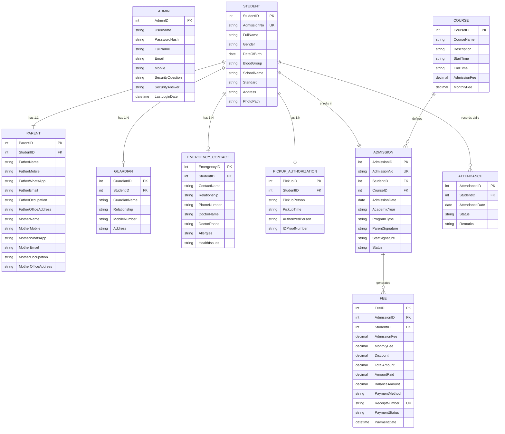

# Entity Relationship (ER) Diagram
## After School Admission Management System

The following ER Diagram describes the relational structure, entities, attributes, primary keys, foreign keys, and cardinalities of the database.

### Table Relationships Summary

1. **Student - Parent**: 1 to 1 Relationship. Each student must have parent records (Father & Mother details).
2. **Student - Guardian**: 1 to 1 (or 1 to Many) Relationship for guardian details.
3. **Student - EmergencyContact**: 1 to 1 (or 1 to Many) for emergency contact and medical details.
4. **Student - PickupAuthorization**: 1 to 1 for authorized pickup personnel and ID proofs.
5. **Student - Admission**: 1 to 1 (or 1 to Many historical admissions).
6. **Course - Admission**: 1 to Many. A course (Play School, Evening Tuition, Both) can have multiple student admissions.
7. **Admission - Fee**: 1 to Many. Each admission creates an initial fee record and ongoing monthly payment receipts.
8. **Student - Attendance**: 1 to Many. A student has one attendance record per day.
